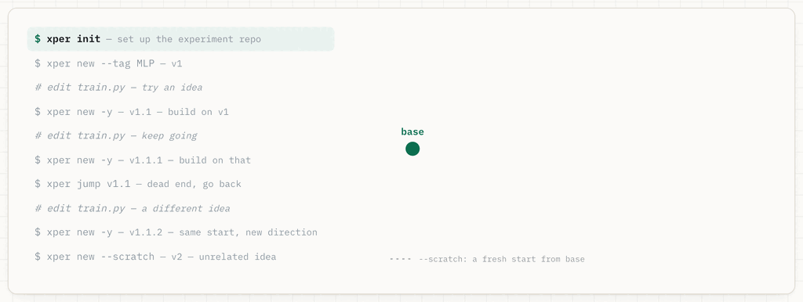
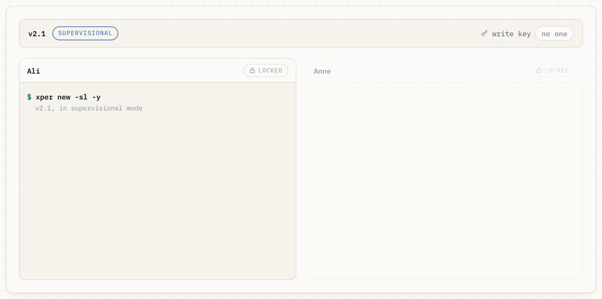

# xper -- eXPERiment tracking and management tool for terminal

It’s git, specialized for research iteration. Every experiment’s name is its ancestry — v1.1.2 is the second thing you tried on top of v1.1, which came from v1. You can read the lineage without looking anything up. Every version is a git branch, and its number is its address. Each one runs in one of two modes: **normal**, where it is yours alone, or **supervisional**, where a group shares it one writer at a time. If bug fix of feature deployed in `v{X}.{Y}` happens after deploying `v{X+n}.{Y}`, then the new release becomes `v{X+n}.{Y+1}`.

## No more merge conflicts

Both `normal` mode and `supervisional` mode have been designed to avoid merge conflicts in two possible ways:

- `Normal` mode dodges merge conflicts by creating new branches.
- `Sequential` mode breaks the spirit of merge conflicts by allowing only one writer at a time to push.

`xper` operates on `normal` mode by default, and here's how it works:



You can switch to `supervisional` or `sequential` mode by running `xper new -sl [options]` command. Here is how supervisional mode works:



You may have some versions (git branches) working on a normal mode and some other versions working on a supervisional mode within the same repository. `xper` cleverly keeps track of everything and gives you immediate feedback whenever you try something wild. However, this is the important part: **it does NOT make you throw away your project and start learning deep internal working mechanisms of the management tool itself -- like git does.**

## Installation & Releases

Run the installation script to install xper:

```bash
git clone https://github.com/AliKhudiyev/xper.git
cd xper && ./install.sh
```

You can uninstall by running:

```bash
./install --uninstall
```

But if you decide to uninstall `xper`, please let me know how `xper` can be improved further so that you could potentially start using it again.

Release version semantics is easy and simple: `xper-vX.Y`. `X` increases by 1 each time there is one or more new features introduced to `xper` that didn't existed before (this also includes new command-line options/flags for `xper` commands), and `Y` increases by one each time there is a bug fix in the feature set of `xper-vX`.

### TODO - v1

- ~Fix `xper new` and make options work.~
- ~Remove `lock` and `unlock`; use `finish` and `modify` properly instead~
- Add intuitive `git` command execution wrapper.
- ~Bug fix: need to `git add` and `git commit` before sensitive `xper ...` operations.~
- ~Add `xper sort [--by <log-field>]` command.~
- Write tests.
- ~[no need; they are different functionality] Add `--acquire|--release` semantics to `update|backup` functions.~
    - ~[no need] `xper backup --acquire` can be done only on a newly created branch (ie, no diff with its parent), and it must be done by the owner initially. This makes the owner to acquire the key automatically upon the creation of the new branch.~
        - ~Make `xper new --acquire` run `xper backup --acquire` semantics behind the scenes. Maybe get rid of `--acquire` semantics for `xper backup`.~
            - ~`xper new --sequential` creates a new sequential version. Optional `--acquire` option immediately runs `xper acquire` after `xper new --sequential`. `--acquire` option in `xper new` (sub)command won't do anything without the `--sequential` flag present.~
    - ~`xper backup` can be done by person holding the key, and this operation will not release they key from the key holder. `xper backup --release` can be done by person holding they key, and this operation will take the write access away from the current key holder/user.~
        - ~`xper release` works only in "sequential" mode; it releases the key and locks the version. get rid of `xper backup --release`.~
    - ~`xper update --acquire` runs `xper update` but unlocks the branch (ie, gives write access) if the key can be acquired. A key can be acquired only when the person with the key does `xper backup --release` on it before this update operation.~
        - ~`xper acquire` runs only in "sequential" mode; it attempts to acquire the key, and if it gets the key (status of ctx:locked and git push with new ctx:locked=1) then the version is unlocked. get rid of `exper update --acquire` option.~
- ~`xper update` should lock the branch (ie, removes write access) whose owner doesn't match the local user, unless the branch is in sequential mode (ie, original owner has run `xper backup --release` on it).~
- ~`xper new` must create `LOCALUSER_vXY` when performed on `OWNER_vXX` by branching from owner's version and giving write accesses back. `dist(XX, XY)` must be as minimum as possible. `reference(LOCALUSER_vXY)=OWNER_vXX`.~
- ~`xper delete` shouldn't do anything on branches not owned by the local user.~
- ~Test and fix `--global` and `--user` options for all (sub)commands.~
- ~Implement `xper sort --only-leaf` that keeps only leaf nodes in the index file after sorting. A node `vXY` is leaf iff there doesn't exist a node `vXYZ` for any `Z`.~
    - ~Implement `xper index [-c|--clear]` to clear index file completely.~
    - ~Implement `xper index [-a|--add] [<version>]]` to add the version (current version by default) to the index file.~
    - ~Implement `xper index [-rm|--remove] [<version>]]` to remove the version from the index file.~
    - ~Implement `xper index <vXX> [--after|--before|--swap <vXY>] to reorder the index file entries `vXX` and `vXY` accordingly.~

### TODO - v2
- Add `xper gitify` and `xperify` commands to convett an xper repo to git repo and an already existing git repo to an xper repo.
- Webify xper repo by
    - Showing reference counts
    - Searching for similar experiments based on references.
    - Counting linear version increments based on the time of version creation (as opposed to version ancestry).
        - `xper sort [-ct|-mt] [sort-options]` for sorting based on the creation/modification timestamps.
        - `xper jump [-ct|-mt] [jump-options]` executes `xper sort [-ct|-mt]` first, then `xper jump [jump-options]`.
            - In fact, `xper jump [-s|sort-options] [jump-options]` always run `xper sort [sort-options]` first (if index file doesn't exist of `-s` flag is present), and then `xper jump [jump-options]`.
        - [no need; `sort -ct` kinda does this] `xper sort -ref` to sort based on true references.
- Add `xper broadcast <file> --to <vXX**> [-g|-u <user>]` to broadcast a file to (1) vXX only -- `<vXX>`, or (2) vXXY for all Y -- `<vXX*>`, or (3) vXXY...Z for all Y...Z -- `<vXX**>`.
- Add `xper run <script> --version <vXX**> [-g|-u <user>] --workers <n>` to run script in implied versions accordingly (similar to `xper broadcast <file> --to <vXX**>`) with up to `n` workers at a time.
- Write tests for all of these new features.

